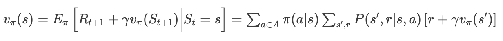

# 01. 강화학습

### 모든 상태에 대한 해답지

본격적으로 강화학습을 공부하기 전에, 예시를 통해 강화학습의 학습 목표를 살펴본다. 

**EX.**

전체 5x5 규격의 그리드 월드가 있다. 이 그리드 월드 환경의 목표는 시작지점인 (1,1)에서 도착지점인 (5,5)까지 장애물에 부딪치지 않고 도착하는 것이다. 이 문제를 해결하는 가장 쉬운 방법을 생각해보자! 

---

가장 쉬운 방법은 행위 수행자가 각 좌표에서 가도 되는 방향과 가지 말아야 할 방향을 전부 알려주는 것이다.

목표달성을 위해 행위 수행자에게 알려주면 되는 것은 각 좌표와 행동집합의 점수다. 점수는 높을수록 행동이 목표 달성에 유리하다는 뜻을 내포하며, 하나의 좌표에서 가능한 행동 집합은 (상,하,좌,우)로 모든 좌표에서 동일하다. 따라서 이 5x5 그리드 월드에서는 4*5*5로 모든 행동 정보를 담아낼 수 있다. 

강화학습은 탐색을 통해 완전한 행동 표를 얻는 것을 목표로 하며, 학습을 통해 값을 채워나간다. 

## 강화학습이란?

강화학습은 보상을 통해 주어진 상황에서 어떤 행동을 취할 것인지를 학습한다. 이 학습 방법론은 상과 벌을 통해 행위 수행자의 행동을 유도하는 심리학 개념인 보상 이론에서 착안했다. 학습 초기의 강화학습은 상황과 행동에 대한 아무런 정보가 없다. 그저 랜덤한 행동을 수행하며 행동에 따른 상벌을 받는다. 강화학습의 행위 수행자는 이 값을 바탕으로 특정 상황에서 특정 행동을 하는 것에 값을 매기고 갱신하며 가장 높은 보상을 받을 수 있는 행동 집합을 구하고자 한다. 

## 에이전트와 환경

강화학습은 에이전트와 환경으로 구성되어 있다. 에이전트는 어떤 행동을 할 것인지 결정하는 의사 결정자이자, 어떤 행동이 높은 보상을 가져다주는지를 학습하는 학습자다. 환경은 에이전트를 둘러싼 모든 것으로, 에이전트를 제외한 나머지로도 표현할 수 있다. 

강화학습에서 학습은 **에이전트와 환경의 상호작용**을 통해 이뤄진다. 

1. 먼저 환경이 현재 에이전트의 상태를 에이전트한테 제공한다. 
2. 에이전트는 받은 상태에서 어떤 행동을 할 것인지 선택하고, 행동한다. 
3. 환경은 에이전트의 행동을 받고, 그에 따른 보상과 행동에 따라 변한 상태를 에이전트에게 반환한다. 
4. 이때 에이전트는 행동에 따라 변화된 여러 상태를 탐험하는 과정을 반복하며 어떤 행동을 해야 좋은 결과를 얻는지를 학습한다. 

## 강화학습의 구성 요소

1. **state_상태**
    
    상태는 환경이 에이전트에게 제공하는 현재 상황 정보다. 
    
    상태의 표현 형식은 다양하다. 명확한 특정 상태를 모사할 수도 있고, 추상적으로 표현할 수도 있다. 예를 들어, 5x5 그리드 월드에서 상태를 표현하는 가장 직관적인 방법은 좌표다. 좌표는 위치에 대한 정보를 직관적으로 전달한다는 장점이 있지만, 여러 장애물과 현재 위치 간의 정보를 담진 못한다. 이를 위해서는 다소 추상적인 방식의 상태 표현이 사용된다. 양과 음의 보상을 갖고 있는 좌표와 현 좌표 간의 차이를 담은 값을 상태로 주는 것이다. 이런 방식은 직관적으로 현 위치를 나타내지는 못하지만, 더 많은 환경에 대한 정보를 상태에 표현할 수 있다. 따라서 상태를 표현하는 방법은 강화학습을 구현할 때 핵심적으로 고민해야 하는 요소다. 
    
2. **action_행동**
    
    행동은 에이전트가 상황에서 수행하고자 결정하고 실행하는 대상이다. 
    
    일반적으로 모든 상태에서 같은 행동 집합이 존재한다. 
    
3. **policy_정책**
    
    정책은 모든 상태에서 에이전트가 어떤 행동을 해야하는지 알려주는 지표다. 정책은 가능 행동이 각각 선택될 확률을 지정하고, 그 확률을 행동 선택의 지표로 사용한다. 단순할 경우, 정책은 모든 상태에 모든 행동의 확률을 적어둔 표로 표현할 수 있다. 하지만 일반적인 상황에서 이는 엄청난 양의 계산 비용을 필요로 하기에 비효율적이라는 단점이 있다. 
    
4. **reward_보상 신호**
    
    보상이란 에이전트 행동에 대해 환경이 전달해주는 숫자값이다. 보상은 행동을 했을 때 즉각적으로 그 행동이 좋은지, 나쁜지 평가해주는 지표가 된다. 따라서 보상은 특정 상태에서 특정 행동이 좋은지 나쁜지를 알 수 있고, 간접적으로 규칙을 학습하는 지표가 된다. 
    
5. **value_가치 함수** 
    
    가치란 특정 상태의 시작부터 일정 시간 동안 에이전트가 기대할 수 있는 보상의 총량이다. 따라서 가치는 장기적인 관점에서 상태를 표현할 수 있고, 이는 행동 보상의 합을 최대로 만들고자하는 강화학습의 학습 목표와 밀접하다. 따라서 일반적으로 에이전트는 보상 대신, 가치를 기준으로 행동을 결정한다. 
    
6. **model_주변 환경에 대한 모델** 
    
    환경 모델은 환경의 변화를 모사해, 환경이 어떻게 변할 지를 추정할 수 있게 해준다. 환경 모델은 현재 상태와 행동으로부터 다음 상태와 보상을 예측한다. 이런 모델을 사용하는 경우를 모델 기반 방법이라 한다. 반대로, 모델 없이 전적으로 시행착오를 통해 학습하는 경우는 model-free 방법이라 한다. 
    

### 환경과 에이전트 : 구성 요소를 바탕으로

에이전트는 행동, 정책을 담당하고 환경은 보상, 상태, 환경 모델을 담당한다. 이 구분이 중요한 이유는 코드로 강화학습을 구현할 때 어떤 것을 에이전트/환경에 넣는지 아는 것이 중요하기 때문이다. 

## 02. 강화학습을 수학적으로 정의하자!

## 순차적 행동 결정 문제

 강화학습에서 에이전트는 매 스텝마다 자신의 행동을 결정한다. 결정은 다음 선택에 영향을 미치기에 현재 상태는 이전 상태와 행동에 의존적이다. 이처럼 순차적으로 선택을 하고, 그 선택을 바탕으로 또 다른 선택을 하는 과정을 **순차적 행동 결정 문제**라고 한다. 강화학습은 순차적 행동 결정 문제(sequential decision-making problem)를 해결하고자 고안된 하나의 방법론이다. 강화학습 이전에는 다이나믹 프로그래밍, 진화 알고리즘과 같은 방법론들이 이 문제를 해결하기 위해 사용되었다. **MDP(Markov Decision Process)**는 순차적 행동 결정 문제를 수학적으로 표현해 이론화시킨 것이다. 

## 강화 학습 용어 수학적 재정의

  MDP가 무엇인지 정확히 설명하기 전, 앞서 언급한 강화학습의 기본 용어들을 수학적으로 재정의하는 과정이 필요하다. 

1. **에이전트와 환경은 연속되는 이산적 time step마다 상호작용한다.** 
    
    한 번의 강화를 위해서는 두 time step을 걸친 환경과 에이전트의 상호작용이 요구된다. 이때 time step은 (t=0,1,2,3,4,…)로 이산적이다. 모든 time step $t$에서 에이전트는 환경의 상태 $S_t$를 받고, 그에 따라 행동 $A_t$를 취한다. 환경은 다음 time step $t+1$에서 보상 $R_{t+1}$을 에이전트에게 주고, 새로운 상태 $S_{t+1}$을 에이전트에게 제공한다.
    
2. **State($S_t$)** : 집합($S$)는 에이전트가 관찰 가능한 상태의 유한 집합이다. 
    
    MDP 문제에서 상태는 시간에 따라 확률적으로 변하기 때문에 특정 시점 $t$의 상태는 고정되어 있지 않다. 따라서 특정 시점  $t$의 상태는 확률변수 $S_t ∈ S$ 로 표현될 수 있다. 
    
3. **Action$(A_t)$** : state $S_t$에서 할 수 있는 행동 집합을 의미한다. 
    
    엄밀하게는 $A_t ∈ A(S)$으로 정의되지만, 일반적으로 모든 상태에서 행동 집합은 동일하다. 
    
4. **Reward($R_{t+1}$)** : 바로 직전 state $S_t$와 행동$A_t$에 의존적인 이산 확률 분포를 갖는다. 
    
    한 번의 강화는 state-action-reward로 구성되는데 보상만 time step이 다르다. 이는 보상은 에이전트가 아니라, 에이전트의 행동을 반영한 환경이 주는 것이기 때문이다. 이는 time step의 기준은 에이전트의 행동 결정과 수행을 기준으로 한다는 것을 알려 준다. 
    

💡 **확률 변수(random variable)란?**   

확률 변수는 표본공간(Sample space) 중 랜덤으로 하나의 값을 갖는 변수다. 따라서 확률 변수는 표본 공간을 domain으로 갖는 함수라 볼 수 있다. 예를 들어, state의 경우 $S_t ∈ S$의 $S_t$는 $S$를 표본 공간으로 갖는 확률 변수로, $S$ 중 하나의 값을 랜덤으로 모든 $t$ step에 받는다. 

## MDP(**Markov Decision Process)**

마르코프 의사 결정 과정은 **이산적인 시간에서의 확률 제어**다. MDP는 부분적으로 랜덤성을, 부분적으로 제어의 성격을 갖는 의사 결정 과정을 수학적으로 정의한다. 

- **MDP의 과정**

 **state $S_t$**에서 **가능한 행동($A(S)$) 중에 하나($a$)**를 취한다. 핵심은 state $S_t$에서 **다음 state** $S_{t+1}$으로 전이될 때, 전이되는 방식이 **확률적**이라는 것과 그에 따른 **보상**이 존재한다는 것이다. 

[https://en.wikipedia.org/wiki/Markov_decision_process](https://en.wikipedia.org/wiki/Markov_decision_process)

이 과정은 $S_t=s, A_t=a, S_{t+1}=s', R_{t+1}=r$으로 정의되는 식을 통해 설명할 수 있다. 

> **MDP의 dynamic을 정의하는 함수** $p$  
$p(s',r|s,a) = Perc({S_{t+1}=s', R_{t+1}=r | S_t=s, A_t=a})$
> 

함수 p를 통해서 환경에 대한 모든 정보를 계산할 수 있다. 

---

1. **상태 전이 함수**  
 $P(s'|s,a) = P[S_{t+1}=s'|S_t=s,A_t=a] = \sum_{r\in R}P\left( s',r| s,a\right)$
    
    상태 전이 함수란 상태 $s$와 행동 $a$ 이후에 따라오는 상태 $s'$에 갈 수 있는 확률을 나타낸다. 다시 말해, 이 함수는 상태가 전이될 때 성공할 확률이라 해석할 수 있으며, **MDP의 핵심**이다. 
    
2. **보상 함수**  

a.  
$
r(s,a) =E[R_{t+1} | S_t=s, A_t=a]=\sum _{r\in R}r\sum _{s' \in S}P\left( s',r| s,a\right)
$
        
state $s$와 행동 $a$ 뒤에 따라오는 총 보상을 계산한 값이다. 
        
b.  
$
r(s,a,s') =E[R_{t+1} | S_t=s, A_t=a, S_{t+1}=s'] = \sum _{r\in R} r \frac{P(s',r|s,a)}{P(s'|s,a)}
$
        
state $s$와 행동 $a$ , next state $s'$ 뒤에 따라오는 총 보상을 계산한 값이다.  
→ 보상 함수가 **기댓값**으로 표현되는 이유는 환경에 따라 같은 상태에서 같은 행동을 하더라도 다른 보상이 나올 수 있기 때문이다. 
    

합으로 표현된 식이 이해가 가지 않는다면, 위 그래프를 참고해 생각해보자. 

## 강화학습의 학습 목표와 보상

강화학습의 학습 목표는 행동 보상의 합을 최대화시키는 것이다. 목표 달성을 위해서는 근시안적 보상이 아닌, 장기적 총 보상을 목표해야 한다. 이를 위해서 강화 학습은 보상이 아닌, 가치를 우선시 한다. 

### 강화학습의 학습 테스크와 가치

강화학습은 에피소드 형식으로 학습된다. 에피소드는 유한 시간 동안 에이전트와 환경이 상호작용하며, 에피소드의 끝을 나타내는 종단 상태가 존재한다. 이때 총보상을 뜻하는 반환값 $G_t$는 종결 상태에 다다르는 시점까지 보상의 총합이다. 

> $$
G_t = R_{t+1} + R_{t+2} + \dots + R_T
$$
> 

하지만 이렇게 반환값을 표현하는 것은 명확한 종결 시점이 없는 연속적인 상황일 때 문제가 발생한다. 시간이 무한대로 길어지면 반환값의 값 또한 무한대로 발산하기 때문이다. 이 문제를 해결하고자 **할인**이라는 개념을 도입한다. 

### 할인

할인이란, 미래보상의 현재가치로 보상을 계산하는 것이다. 이는 미래의 보상을 현재 시점에 미리 땡겨서 받으면 더 적어진다는 개념으로, 더 미래로 갈수록 그 정도가 심해진다. 할인은 각 타임 스텝의 보상에 할인율 $\gamma$(gamma) 을 곱하는 방식으로 적용된다. 

$
G_t = R_{t+1} + \gamma R_{t+2} + \dots = \sum_{k=0}^{\infty} \gamma^k R_{t+k+1}
$

할인율이 [0,1]의 값임으로 무한대로 발산하더라도 반환값은 특정 값으로 수렴한다. 이는 앞서 말했던 연속적인 문제의 보상값 발산을 해결한다. 또한 할인율은 0에 가까울수록 근시안적으로 반환값을 다루고, 1에 가까울수록 미래의 보상을 더 많이 고려하는 것으로 해석할 수 있어 표현력을 높여주는 효과가 있다. 

일반화된 MDP의 사건은 일정 시점 $T$을 넘어가면 보상을 0으로 주는 방법으로 연속적인 사건과 에피소딕한 사건을 모두 포함한다. 

### MDP를 정의하기 위해 필요한 것

**MDP를 정의하기 위해 필요한 것** : ($S,A,P,R,\gamma$)

이제 MDP 문제를 위한 모든 용어를 익혔다. 남은건 적용 뿐!

 + P 는 상태 전이 함수다. 

## 정책과 가치함수

### 가치함수

**가치함수**란 현재 에이전트가 주어진 상태에 있는게 얼마나 좋은가를 추정하는 함수다. 즉, 가치 함수는 input이 state, output이 실수인 함수다.  

> $v : State → R$
> 

얼마나 좋은가는 기대되는 미래의 보상을 기준으로 하며, 이는 이전 행동에 따라 다르다. 

이전 행동은 정책에 의해 결정되기에, 가치함수와 정책은 유기적이다. 

### 정책

**정책($\pi$)**에는 모든 상태에서 에이전트가 수행할 행동이 정의되어 있다. 정책은 특정 상태에서 특정 행동을 선택하는 것을 확률로 표현한다. 다시 말해 정책은 특정 상태에서 특정 행동을 할 확률을 정의한다. 이때 정책에서 어떤 결정을 할지 판단하는데 가치함수가 이용된다. 

정책에서 특정 상태에 어떤 선택을 하는지는 일반적으로 **탐욕적**으로 정해진다. 탐욕적인(greedy) 선택은 선택지 중 가장 큰 값을 선택하는 방식이다. 따라서 정책에서 탐욕적인 선택은 모든 상태마다 가장 가치가 높은 행동을 선택하는 것을 의미한다. 

MDP 문제 : 1.정책을 통해 현재 상태에서 행동을 선택한다. 2. 상태 전이 함수를 통해 현재 상태에서 다음 상태로 확률적으로 전이된다. 3. 수행한 행동과 다음 상태를 바탕으로 보상이 에이전트에게 주어진다. 

### 정책으로 표현된 가치함수

가치함수는 상태만을 기준으로 하는 상태 가치 함수와 상태와 행동을 기준으로 하는 행동 가치 함수가 있다. 

---

-  **정책 $\pi$에 대한 상태 가치 함수** 
    
상태  $s$에서 시작한 이후로 정책 $\pi$를 따랐을 경우 얻게 되는 이득의 기댓값
    
$
v_{\pi}(s) = E_{\pi}[G_t | S_t=s] = E_{\pi} \left[ \sum_{k=0}^{\infty} \gamma^k R_{t+k+1} \Big| S_t=s \right]
$
    
- **정책 $\pi$에 대한 행동 가치 함수(Q 함수)**
    
상태  $s$에서 행동 $a$를 취하고 그 이후로 정책 $\pi$를 따랐을 경우 얻게 되는 이득의 기댓값
    
$
q_{\pi}(s,a) = E_{\pi}[G_t | S_t=s, A_t=a] = E_{\pi} \left[ \sum_{k=0}^{\infty} \gamma^k R_{t+k+1} \Big| S_t=s, A_t=a \right]
$
    

---

상태 가치 함수는 이론적으로 가장 기본적인 가치 함수다. 따라서 상태 가치 함수는 일반적으로 이론적인 정의부분에서 많이 이용된다. 하지만 실질적인 이용 빈도는 행동 가치 함수가 높다. 강화학습은 결과적으로 특정 상태에서 어떤 행동을 하는 것이 유리한가를 학습하고자 한다. 이때 상태 가치 함수는 그저 현재의 상태에 대한 가치만을 나타내기 때문에 MDP 상황이 정의된 모델이 없다면 사용할 수 없다. 반대로 행동 가치 함수는 특정 상태에서 행동의 가치를 알 수 있기 때문에 모델이 정의되어 있지 않아도 사용할 수 있다. 

두 가치 함수는 재귀적인 형태로 표현할 수 있다. 기존의 가치 함수는 상태 s 이후의 모든 상태의 보상을 전부 알아야 하는 어려움이 있었다. 하지만 가치 함수를 재귀로 표현하면, 상태 $s$의 가치 함수를 구할 때 다음 단계 $s'$의 가치 함수만을 알면 되기에 문제가 단순해진다. 이 재귀로 표현된 식이 바로 **벨만 방정식**이다.   

## 벨만 방정식

**상태 가치 함수**   

- **상태 가치 함수 유도하기**
    

**행동 가치 함수**  
$$q_{\pi}(s,a) = E_{\pi}[R_{t+1}+\gamma q_{\pi}(s',a)(S_{t+1})|S_t=s]$$

    
벨만 방정식은 가치 함수의 해를 구하는 방법론이다. 

이 방정식은 어떤 상태 $S_t$와 이어지는 상태의 값 ($S_{t+1}=s'$) 사이의 관계를 표현하고 있다. 모든 가능성에 대해 특정 사건이 발생할 확률을 가중치로 하여 기댓값을 계산하며, $v_{\pi}(s')$은 $s$의 주변 상태인 $s'$으로 구할 수 있다. 

행동 가치 함수와 상태 가치 함수는 경험으로부터 추정될 수 있다. 학습 초기 에이전트는 제대로 된 정책을 갖고 있지 않아 우변인 상태 $s$의 가치와 좌변의 값이 동일하지 않다. 여러 에피소드를 반복하며 학습하다보면, 양변 사이의 균형이 맞게 되고 모든 상태에서 균형이 안정된 가치함수를 **참가치 함수**라 부른다. 

### 최적 정책(Optimal Policy)

**최적 정책** $\pi_*$은 가장 큰 가치를 갖는 정책이며, 강화학습의 최종적 학습 목표 값이다. 

최적 정책을 수식으로 표현하면 아래와 같다. 

> $∀  s \in S, v_{\pi}(s) ≥ v_{\pi'}(s) → \pi ≥ \pi' ⇒ \pi is Optimal Policy$
> 

가치 함수가 좋은 정책을 판단하는 지표이기 때문에, 최적 정책인가를 판단하기 위해서는 가치 함수가 필요하다.

 **최적 가치 함수**는 최적 정책을 따를 때의 가치 함수로, 아래와 같이 표현된다. 

- **최적 상태 가치 함수** : $v_*(s) = max_{\pi}v_{\pi}(s)$
- **최적 행동 가치 함수** : $q_*(s,a) = max_{\pi}q_{\pi}(s,a)$

---

정책은 상태와 행동에 관한 지표다. 따라서 최적 정책을 판단하는 기준으론 일반적으로 큐함수가 사용된다. 최적 정책은 각 상태 s에서 가장 큰 큐함수를 가진 행동을 하는 것으로, 최적 큐함수 값을 알고 있다면 손쉽게 구할 수 있다. 

이런 최적 가치 함수는 **벨만 최적 방정식**을 통해 구할 수 있다. 

위쪽부터 차례대로 최적 상태 가치 함수를 구하기 위한 최적 벨만 방정식, 최적 행동 가치 함수를 구하기 위한 최적 벨만 방정식이다. 

## 벨만 방정식을 통한 MDP 해결

벨만 방정식을 통해 MDP 문제를 해결하는 것은 수학적인 완결성이 보장된 문제다. 하지만 벨만 방정식을 풀어 MDP 문제를 해결하는 것은 효용이 아주 낮다. 모든 가능성을 내다보고 그 가능성의 발생 확률을 계산하며, 보상의 기댓값 측면에서 얼마나 좋은지를 계산하는 빈틈없는 탐색이기 때문이다. 또한 이 방식은 3가지 조건이 충족되어야지만 계산될 수 있다. 

1. 환경의 구조를 명확하게 알아야 한다. 

2. 전체를 계산할만큼 충분한 계산 능력을 가져야 한다. 

3. 마르코프 성질을 가정해야 한다.

하지만 일반적인 케이스에서 이 세 가지 조건을 전부 충족시키는 것은 불가능에 가깝기에, 근사적인 해를 찾는 방향으로 강화학습은 발전해나가고 있다. 

> 1. **다이나믹 프로그래밍** : 3가지 조건이 충족되는 상황에서 가치 함수를 계산하는 방법론 
> 2. **강화학습** : 근사적으로 가치 함수를 찾는 방법론  

---

## 문제

1. 정책의 정의 : 00 상태에서 에이전트가 어떤 00을 해야할 지 알려주는 지표. 
2. 정책은 탐욕적이다. 탐욕적인 것(greedy)은 무엇인가? 
3. 행동 가치 함수와 상태 가치 함수의 차이점에 대해 서술하시오.
4. 보상과 가치의 차이점
5. 참가치 함수와 최적 가치 함수는 동일하다. (O,X)
6. 벨만 기대 방정식과 벨만 최적 방정식의 차이점
7. 행동 가치 함수 공식 유도 직접 해보기 

## 출처

1. [https://dnddnjs.gitbooks.io/rl/content/](https://dnddnjs.gitbooks.io/rl/content/)
2. 단단한 강화학습
3. 파이썬과 케라스로 배우는 강화학습