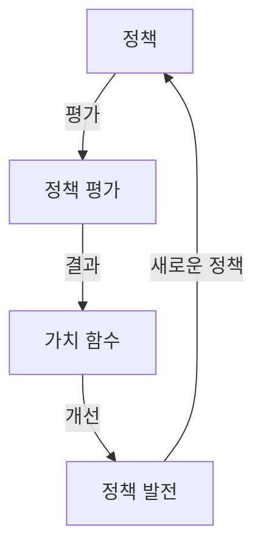

# 다이나믹 프로그래밍

**목차**

# 다이나믹 프로그래밍

## 다이나믹 프로그래밍의 개념

복잡한 문제를 작은 문제들로 나누어 해결하는 최적화 기법

## 왜 사용할까?

큰 문제 안에 동일한 작은 문제가 여러 번 반복될 때, 그 결과를 메모리에 저장하거나 테이블에 저장해서 중복 계산을 피하는 방식으로 효율성을 높일 수 있다.

 작은 문제들의 답을 서로 이용한다는 특징이 있다.


예를 들어, 피보나치 수를 구하고 싶을 때, 재귀적으로 함수를 구성하면 f(n) = f(n-1) + f(n-2) 이다. 이때 하나의 값을 여러 번 계산해야 하는 현상이 발생하고 더 큰 피보나치 수를 구하고자하면 함수가 호출되는 횟수가 기하급수적으로 증가한다.

→ 한 번 구한 값을 저장해두고 재사용하면 불필요한 반복을 하지 않아 매우 효율적으로 문제를 해결할 수 있다.

## 다이나믹 프로그래밍의 두 가지 방법

1. Top-Down: 큰 문제를 재귀적으로 풀면서, 중간 결과를 메모리에 저장해 중복 계산을 방지하는 방식 
2. Bottom-Up: 작은 문제부터 차례대로 풀어나가서 큰 문제를 해결하는 방식

*그리드월드에서 최적 정책을 찾는 다이나믹 프로그래밍은 Bottom-Up 방식이다.

## 순차적 행동 결정 문제 (복습해보자)

순차적 행동 결정 문제란 에이전트가 여러 단계에 걸쳐 행동을 결정하고, 각 단계에서 내린 결정이 미래에 영향을 끼치는 문제이다.

이를 해결하는 방법에는 여러가지가 있는데, 다이나믹 프로그래밍과 강화학습이 그에 해당한다.

예) 자율 주행자동차, 투자 및 금융 의사 결정 등

## 다이나믹 프로그래밍으로 순차적 행동 결정 문제 해결

1. 순차적 행동 결정 문제를 MDP로 정의한다.
2. 가치함수를 벨만 방적식으로 반복적으로 계산한다.
3. 최적 가치함수와 최적 정책을 찾는다.

---

# 벨만 방정식

현재 상태의 가치함수와 다음 상태의 가치함수의 관계식이다.

다이나믹 프로그래밍의 핵심 원리로, 최적 정책을 구할 때 사용하는 수학적 표현이다. 다이나믹 프로그래밍은 순차적 행동 결정 문제를 해결하기 위해 벨만 방정식을 사용한다.

## 벨만 기대 방정식

정책 π를 따라갔을 때 가치함수 사이의 관계식

현재 상태의 가치가 즉각적인 보상과 미래 상태의 가치에 의해 결정된다는 것을 보여준다. 


## 벨만 최적 방정식

모든 가능한 정책 중에서 최적 정책을 따랐을 때 가치함수 사이의 관계식

상태 s에서 취할 수 있는 모든 가능한 행동들 중 최고의 행동을 선택하는 것을 볼 수 있다.


---

# 정책 이터레이션 & 가치 이터레이션

MDP로 정의된 순차적 행동 결정 문제에서 목표는 에이전트가 받을 보상의 합을 최대로 하는 것이다. 에이전트는 가치함수를 통해 자신이 이 목표에 얼마나 다가갔는지 알 수 있다.

## 정책 이터레이션

**벨만 기대 방정식**을 사용해 MDP로 정의되는 문제를 푸는 방식이다.



### 1. 정책 평가

정책은 가치함수로 평가한다.

현재 정책이 주어졌을 때, 각 상태의 가치를 벨만 기대 방정식으로 계산한다.


이 과정을 모든 상태에 대하여 동시에 진행하는 것이 정책 평가 한 번을 수행하는 것에 해당한다. 모든 상태에 대해 **참 가치 함수**를 얻을 때까지 정책 평가를 반복한다. 즉, 가치 함수가 수렴할 때까지 모든 상태에 대하여 벨만 기대 방정식을 계산하는 것을 반복한다.

### 2. 정책 발전

정책 평가를 통해 구한 모든 상태에 대한 가치함수를 기반으로, 각 상태에서 어떤 행동을 해야 좋을지 결정하여 정책을 개선한다. 

**탐욕적 정책 발전**

탐욕적 정책 발전이란 주어진 가치 함수에 따라, 각 상태에서 가능한 행동 중 즉각적으로 가장 큰 보상을 주는 행동을 선택하는 방식이다. 즉, 상태 s에서 선택 가능한 행동들의 큐함수(행동의 가치)를 비교하고 그 중에서 가장 큰 큐함수를 가지는 행동을 선택한다. 이 과정을 모든 상태에 대해 수행하여 새로운 정책을 만든다.

가장 큰 큐함수를 가지는 행동을 선택하면 되기 때문에 단순하고 효율적이다.


정책 발전을 통해 찾은 새로운 정책에 대하여 위의 과정을 반복하여 최적 정책을 찾는 것이 정책 이터레이션이다.

## 가치 이터레이션

**벨만 최적 방정식**을 사용해 MDP로 정의된 문제를 푸는 방식이다.

현재 가치 함수를 최적 정책에 대한 가치 함수라고 가정하고, 벨만 최적 방정식을 계산하여 각 상태의 가치를 업데이트 한다. 이때 한 번의 반복을 통해 현재 상태에서 가장 큰 보상을 주는 최적 행동(최적 정책)을 계산한다. 

가치 이터레이션은 현재 가치 함수가 최적 가치 함수라고 가정하기 때문에 정책 발전이 필요 없다. 따라서 각 상태의 최적 가치함수를 기반으로 바로 최적의 행동을 선택해가면서 가치 함수가 수렴할 때까지 벨만 최적 방정식 계산을 반복한다. 


즉, 현재 가치 함수가 최적 가치 함수 v*(s)라고 가정하고 모든 상태에 대하여 위의 벨만 최적 방정식을 계산하여 새로운 가치 함수를 업데이트한다. 새로운 가치 함수가 곧 새로운 정책이다.

## 비교 & 정리

정책 이터레이션과 가치 이터레이션 모두 가치함수를 여러 번 쪼개서 구한다.


그러나 정책 이터레이션은 하나의 정책에 대하여 여러 번 가치함수를 구하여 참 가치함수를 얻지만, 가치 이터레이션은 계속해서 새로운 정책에 대해 가치함수를 구하면서 최적 가치함수를 얻는다.

|  | 정책 이터레이션 | 가치 이터레이션 |
| --- | --- | --- |
| 정책 | 명시적  | 내재적 |
| 과정 | 1. 가치 함수를 현재 정책에 대한 가치 함수라고 가정하고
2. 반복적으로 계산
3. 현재 정책에 대한 참 가치함수 | 1. 가치 함수를 최적 정책에 대한 가치 함수라고 가정
2. 반복적 계산
3. 최적 정책에 대한 참 가치함수 |
| 정책 평가 | 정책이 주어지면 여러 번 반복하여 각 상태의 가치를 평가 | 벨만 최적 방정식을 통해 한 번의 반복으로 평가 |
| 정책 발전 | 정책 평가 후 정책을 발전 | 매 반복마다 정책을 업데이트하며 가치 함수 계산 |
| 수렴 속도 | 가치 함수가 수렴할 때까지 정책 평가를 반복하므로 상대적으로 느림 | 빠르게 수렴하지만 한 번의 평가가 불완전할 수 있음 |
| 복잡도 | 정책 평가에서 여러 번 반복이 필요해 더 복잡 | 정책 평가와 개선이 동시에 이루어져 계산이 더 단순 |
| 효율성 | 큰 상태 공간에서는 비효율적 | 큰 상태 공간에서 더 빠르고 효율 |
| 적용 시점 | 정확한 정책 평가가 필요한 경우 적합 | 빠른 근사치로 최적 정책을 찾고자 할 때 적합 |

---

# 예제 : 그리드 월드


- 5  x 5 상태 공간
- 빨간색 네모: 에이전트
- 에이전트는 파란색 동그라미로 가야한다.
- (-1)의 보상을 주는 연두색 세모가 있다.
- 이 결정론적 그리드 월드에서는 상태 변환 확률을 왼쪽으로 가는 행동을 할 때 1의 확률로 왼쪽으로 가는 것으로 설정. 즉, 에이전트가 왼쪽으로 가는 행동을 했다면 다음 타임스텝에 무조건 왼쪽으로 이동한다.

## 정책 이터레이션 구현

### 전체 코드

```python
import random
from environment import GraphicDisplay, Env

class PolicyIteration:
    def __init__(self, env):
        # 환경에 대한 객체 선언
        self.env = env
        # 가치함수를 2차원 리스트로 초기화
        self.value_table = [[0.0] * env.width for _ in range(env.height)]
        # 상 하 좌 우 동일한 확률로 정책 초기화
        self.policy_table = [[[0.25, 0.25, 0.25, 0.25]] * env.width
                                    for _ in range(env.height)]
        # 마침 상태의 설정
        self.policy_table[2][2] = []
        # 할인율
        self.discount_factor = 0.9

    def policy_evaluation(self):

        # 다음 가치함수 초기화
        next_value_table = [[0.00] * self.env.width
                                    for _ in range(self.env.height)]

        # 모든 상태에 대해서 벨만 기대방정식을 계산
        for state in self.env.get_all_states():
            value = 0.0
            # 마침 상태의 가치 함수 = 0
            if state == [2, 2]:
                next_value_table[state[0]][state[1]] = value
                continue

            # 벨만 기대 방정식
            for action in self.env.possible_actions:
                next_state = self.env.state_after_action(state, action)
                reward = self.env.get_reward(state, action)
                next_value = self.get_value(next_state)
                value += (self.get_policy(state)[action] *
                          (reward + self.discount_factor * next_value))

            next_value_table[state[0]][state[1]] = round(value, 2)

        self.value_table = next_value_table

    # 현재 가치 함수에 대해서 탐욕 정책 발전
    def policy_improvement(self):
        next_policy = self.policy_table
        for state in self.env.get_all_states():
            if state == [2, 2]:
                continue
            value = -99999
            max_index = []
            # 반환할 정책 초기화
            result = [0.0, 0.0, 0.0, 0.0]

            # 모든 행동에 대해서 [보상 + (감가율 * 다음 상태 가치함수)] 계산
            for index, action in enumerate(self.env.possible_actions):
                next_state = self.env.state_after_action(state, action)
                reward = self.env.get_reward(state, action)
                next_value = self.get_value(next_state)
                temp = reward + self.discount_factor * next_value

                # 받을 보상이 최대인 행동의 index(최대가 복수라면 모두)를 추출
                if temp == value:
                    max_index.append(index)
                elif temp > value:
                    value = temp
                    max_index.clear()
                    max_index.append(index)

            # 행동의 확률 계산
            prob = 1 / len(max_index)

            for index in max_index:
                result[index] = prob

            next_policy[state[0]][state[1]] = result

        self.policy_table = next_policy

    # 특정 상태에서 정책에 따른 행동을 반환
    def get_action(self, state):
        # 0 ~ 1 사이의 값을 무작위로 추출
        random_pick = random.randrange(100) / 100

        policy = self.get_policy(state)
        policy_sum = 0.0
        # 정책에 담긴 행동 중에 무작위로 한 행동을 추출
        for index, value in enumerate(policy):
            policy_sum += value
            if random_pick < policy_sum:
                return index

    # 상태에 따른 정책 반환
    def get_policy(self, state):
        if state == [2, 2]:
            return 0.0
        return self.policy_table[state[0]][state[1]]

    # 가치 함수의 값을 반환
    def get_value(self, state):
        # 소숫점 둘째 자리까지만 계산
        return round(self.value_table[state[0]][state[1]], 2)

if __name__ == "__main__":
    env = Env()
    policy_iteration = PolicyIteration(env)
    grid_world = GraphicDisplay(policy_iteration)
    grid_world.mainloop()
```

### policy_evaluation 함수

모든 상태의 가치함수를 업데이트하기 위해 next_value_table을 선언한 다음 계산 결과를 next_value_table에 저장한다. for문으로 모든 상태에 대해 벨만 기대함수를 계산한다.

```python
def policy_evaluation(self):

        # 다음 가치함수 초기화
        next_value_table = [[0.00] * self.env.width
                                    for _ in range(self.env.height)]

        # 모든 상태에 대해서 벨만 기대방정식을 계산
        for state in self.env.get_all_states():
            value = 0.0
            # 마침 상태의 가치 함수 = 0
            if state == [2, 2]:
                next_value_table[state[0]][state[1]] = value
                continue

            # 벨만 기대 방정식
            for action in self.env.possible_actions:
                next_state = self.env.state_after_action(state, action)
                reward = self.env.get_reward(state, action)
                next_value = self.get_value(next_state)
                value += (self.get_policy(state)[action] *
                          (reward + self.discount_factor * next_value))

            next_value_table[state[0]][state[1]] = round(value, 2)

        self.value_table = next_value_table
```

```python
					# 벨만 기대 방정식
           for action in self.env.possible_actions:
                next_state = self.env.state_after_action(state, action)
                reward = self.env.get_reward(state, action)
                next_value = self.get_value(next_state)
                value += (self.get_policy(state)[action] *
                          (reward + self.discount_factor * next_value))

```

- next_state: s’
- reward: r(s,a)
- discount_factor: γ
- next_value: $V
π
(s)$
- for action in self.env.possible_actions


### policy_improvement 함수

정책 평가를 통해 얻은 새로운 가치함수를 통해 정책을 업데이트한다. 업데이트된 정책을 next_policy에 저장한다.

```python
 # 현재 가치 함수에 대해서 탐욕 정책 발전
    def policy_improvement(self):
        next_policy = self.policy_table
        for state in self.env.get_all_states():
            if state == [2, 2]:
                continue
            value = -99999
            max_index = []
            # 반환할 정책 초기화
            result = [0.0, 0.0, 0.0, 0.0]

            # 모든 행동에 대해서 [보상 + (할인율 * 다음 상태 가치함수)] 계산
            for index, action in enumerate(self.env.possible_actions):
                next_state = self.env.state_after_action(state, action)
                reward = self.env.get_reward(state, action)
                next_value = self.get_value(next_state)
                temp = reward + self.discount_factor * next_value

                # 받을 보상이 최대인 행동의 index(최대가 복수라면 모두)를 추출
                if temp == value:
                    max_index.append(index)
                elif temp > value:
                    value = temp
                    max_index.clear()
                    max_index.append(index)

            # 행동의 확률 계산
            prob = 1 / len(max_index)

            for index in max_index:
                result[index] = prob

            next_policy[state[0]][state[1]] = result

        self.policy_table = next_policy
```

탐욕적 정책 발전을 사용하였는데, 이는 가치가 가장 높은 행동 하나를 선택하는 것이다. 그러나 현재 상태에서 가장 좋은 행동이 여러 개일 수도 있다. 때문에 가장 좋은 행동들이 여러 개일 경우 그들을 동일한 확률로 선택한다.

temp에 큐함수([보상 + (할인율 * 다음 상태 가치함수)])을 저장하고 이들 중 가장 큰 값을 가지는 행동의 index를 max_index를 저장한다. 만약 가장 큰 값을 가지는 행동이 여러 개이면 그들의 index를 모두 max_index에 저장하고 prob = 1 / len(max_index)를 통해 그들에게 동일한 확률을 부여하여 새로운 정책에 적용한다.

## 가치 이터레이션 구현

### 전체 코드

```python
from environment import GraphicDisplay, Env

class ValueIteration:
    def __init__(self, env):
        self.env = env
        # 2-d list for the value function
        self.value_table = [[0.0] * env.width for _ in range(env.height)]
        self.discount_factor = 0.9

    # get next value function table from the current value function table
    def value_iteration(self):
        next_value_table = [[0.0] * self.env.width
                                    for _ in range(self.env.height)]
        for state in self.env.get_all_states():
            if state == [2, 2]:
                next_value_table[state[0]][state[1]] = 0.0
                continue
            value_list = []

            for action in self.env.possible_actions:
                next_state = self.env.state_after_action(state, action)
                reward = self.env.get_reward(state, action)
                next_value = self.get_value(next_state)
                value_list.append((reward + self.discount_factor * next_value))
            # return the maximum value(it is the optimality equation!!)
            next_value_table[state[0]][state[1]] = round(max(value_list), 2)
        self.value_table = next_value_table

    # get action according to the current value function table
    def get_action(self, state):
        action_list = []
        max_value = -99999

        if state == [2, 2]:
            return []

        # calculating q values for the all actions and
        # append the action to action list which has maximum q value
        for action in self.env.possible_actions:

            next_state = self.env.state_after_action(state, action)
            reward = self.env.get_reward(state, action)
            next_value = self.get_value(next_state)
            value = (reward + self.discount_factor * next_value)

            if value > max_value:
                action_list.clear()
                action_list.append(action)
                max_value = value
            elif value == max_value:
                action_list.append(action)

        return action_list

    def get_value(self, state):
        return round(self.value_table[state[0]][state[1]], 2)

if __name__ == "__main__":
    env = Env()
    value_iteration = ValueIteration(env)
    grid_world = GraphicDisplay(value_iteration)
    grid_world.mainloop()
```

가치 이터레이션은 정책 이터레이션과 달리 정책 평가와 정책 발전으로 단계가 나누어져 있지 않다. 따라서 ValueIteration 클래스 코드는 좀 더 간단하다. 

정책 이터레이션에서는 가치함수와 정책이 분리되어 있어서 Improve 버튼을 누르면 policy_improvement라는 함수를 통해 정책이 발전했다. 그러나 가치 이터레이션은 현재 가치함수가 최적 가치함수라고 가정하기 때문에 policy_improvement 함수가 필요하지 않다. 따라서 현재 가치함수를 바탕으로 최적 행동을 반환하는 get_action 함수를 사용한다.

또한 정책 이터레이션에서는 policy_evaluation 함수와 policy_improvement 함수로 분리되었던 것이 가치 이터레이션에서는 value_iteration 함수 하나로 대체되었다. 또한 정책이 독립적으로 존재하지 않고 가치함수 안에 내재되어있기 때문에 get_policy 함수가 없다.


정책 이터레이션

```python
 value_list = []

            for action in self.env.possible_actions:
                next_state = self.env.state_after_action(state, action)
                reward = self.env.get_reward(state, action)
                next_value = self.get_value(next_state)
                value_list.append((reward + self.discount_factor * next_value))
```

모든 행동에 대해 큐함수를 계산하고 이중에 max를 next_value_table(새로운 가치함수)에 저장한다.

```python
next_value_table[state[0]][state[1]] = round(max(value_list), 2)
```


---

# 다이나믹 프로그래밍의 한계

다이나믹 프로래밍은 큰 문제를 작은 문제들로 나눠 효율적으로 계산을 빠르게 하는 것이지 “학습”을 하는 것이 아니다.

## 1. 계산 복잡도

다이나믹 프로그래밍의 계산 복잡도는 상태 크기의 3제곱에 비례하기 때문에 상태 공간의 규모가 커지면 복잡도는 기하급수적으로 늘어난다.

## 2. 차원의 저주

상태의 차원이 늘어나면 상태의 수가 지수적으로 증가하기 때문에 메모리 소모가 급격히 증가할 수 있다.

## 3. 환경을 완벽히 알아야 한다.

보상과 상태 변환 확률은 환경에 속한다. 즉, 기존에 우리는 환경 모델을 완벽히 알고 있다는 가정하에 다이나믹 프로그래밍을 사용하였다. 하지만 현실 세계의 문제는 환경에 대한 정보를 완전히 알기가 어렵다.

---

출처

1. 파이썬과 케라스로 배우는 강화학습
2. [https://zoomkoding.github.io/강화학습/2019/07/19/RL-2.html](https://zoomkoding.github.io/%EA%B0%95%ED%99%94%ED%95%99%EC%8A%B5/2019/07/19/RL-2.html)
3. [https://jang-inspiration.com/policy-value-iteration](https://jang-inspiration.com/policy-value-iteration)