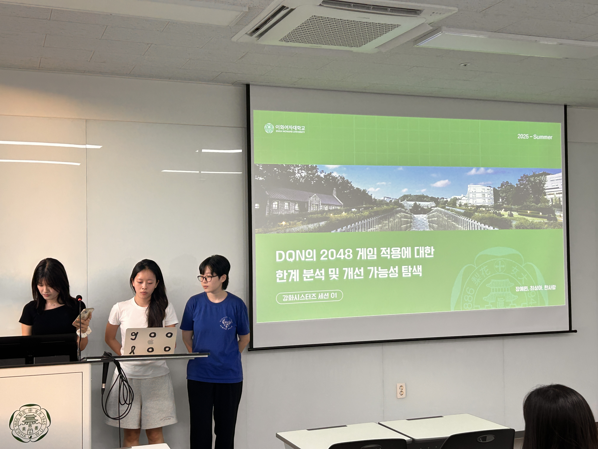
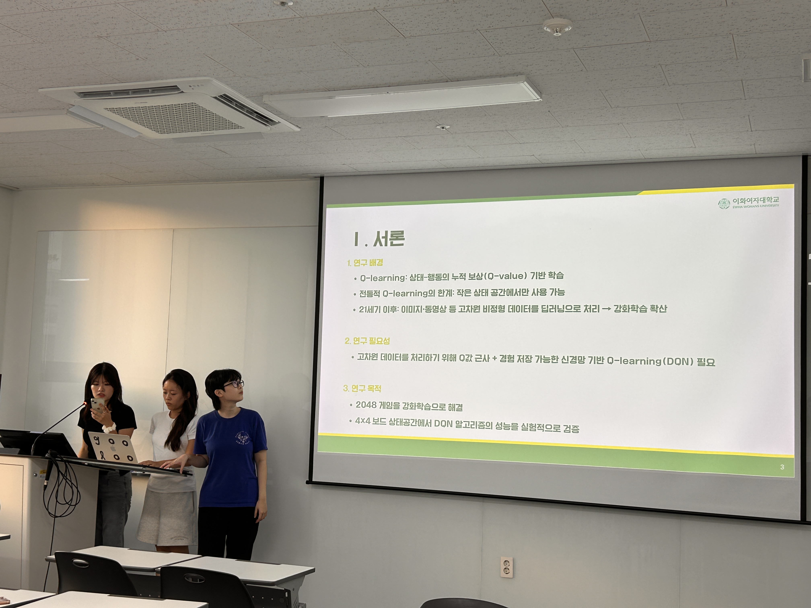
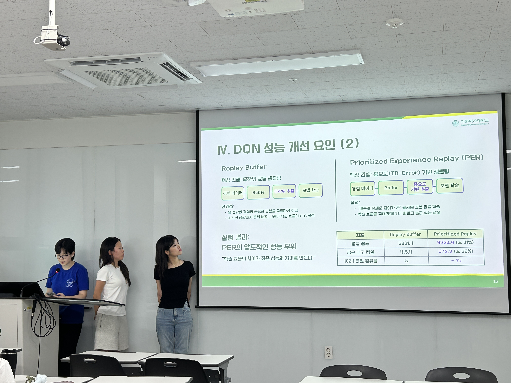
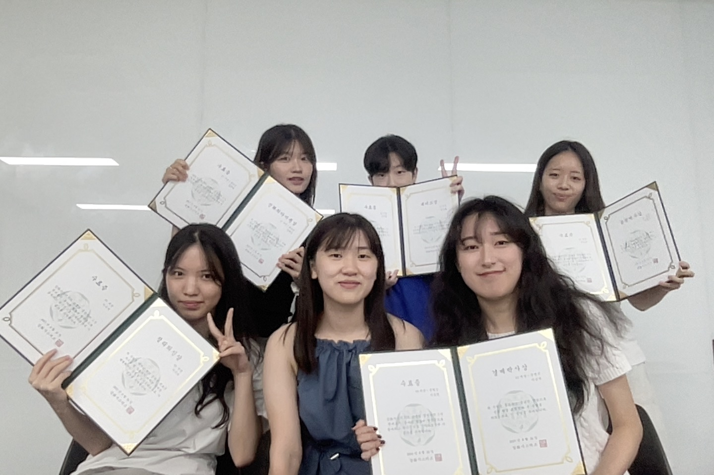

## DQN의 2048 게임 적용에 대한 한계 분석 및 개선 가능성 탐색 

강화시스터즈 3기 01 세션의 프로젝트로, Double/Dueling DQN을 사용해 2048 게임 에이전트를 개발했습니다.  

### 바로가기 ✨
[보고서](../assets/image/Projects/2048/report_2048.pdf)  
[PPT](../assets/image/Projects/2048/ppt_2048.pdf)  
[GitHub](https://github.com/KanghwaSisters/25-2-2048.git)  
[APP:DEMO AI](https://2048-rl-project.vercel.app/)

### 사진 📸
  
  
  
  
  
