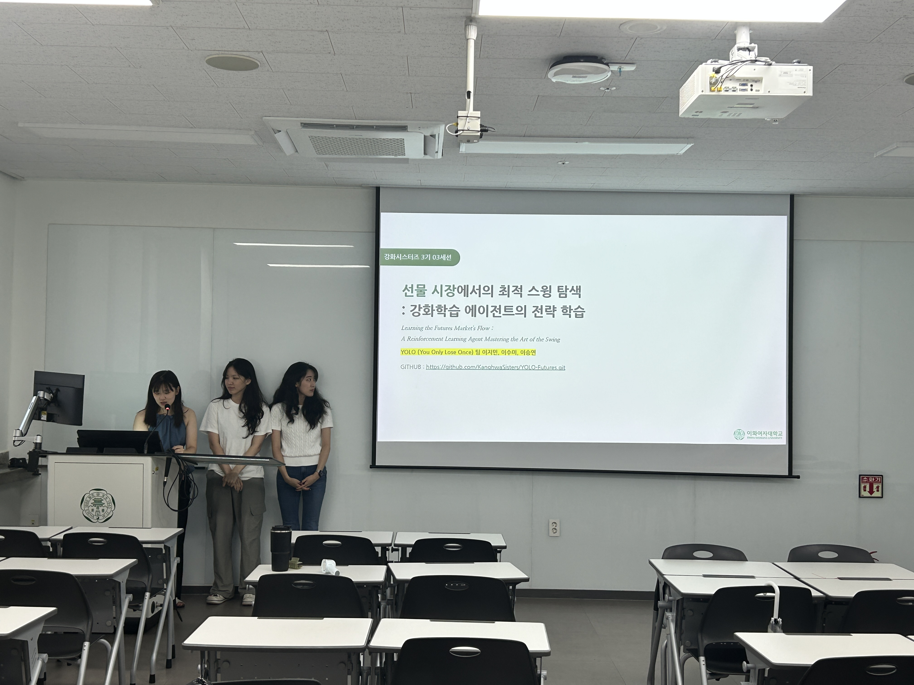
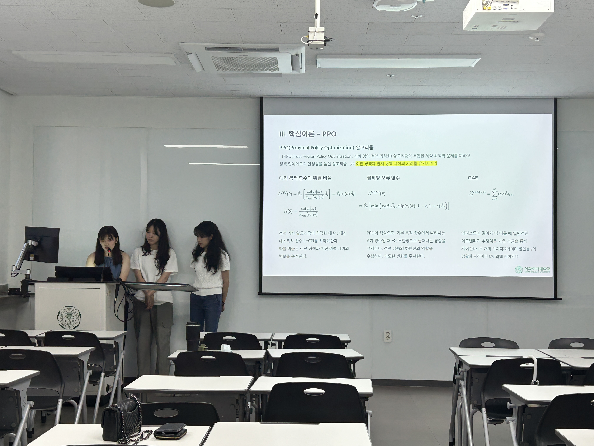
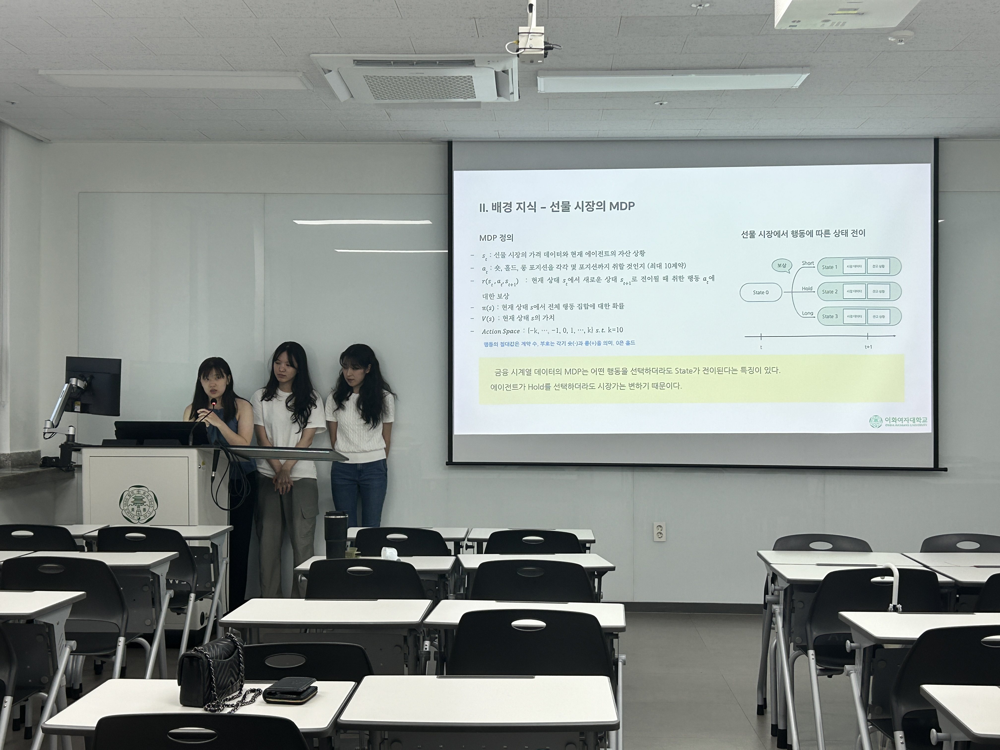
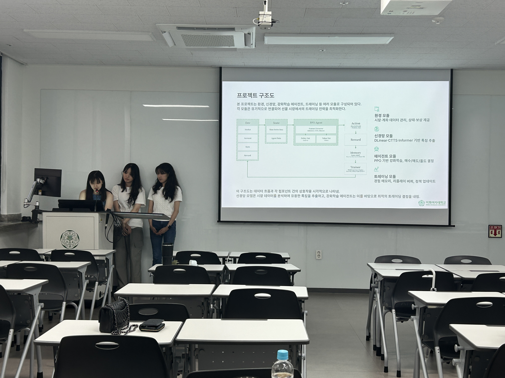
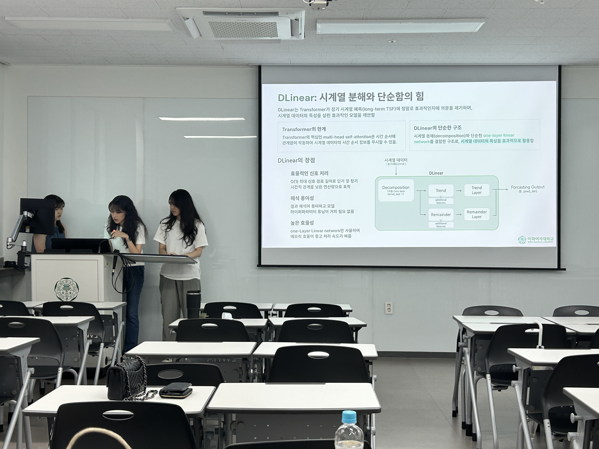
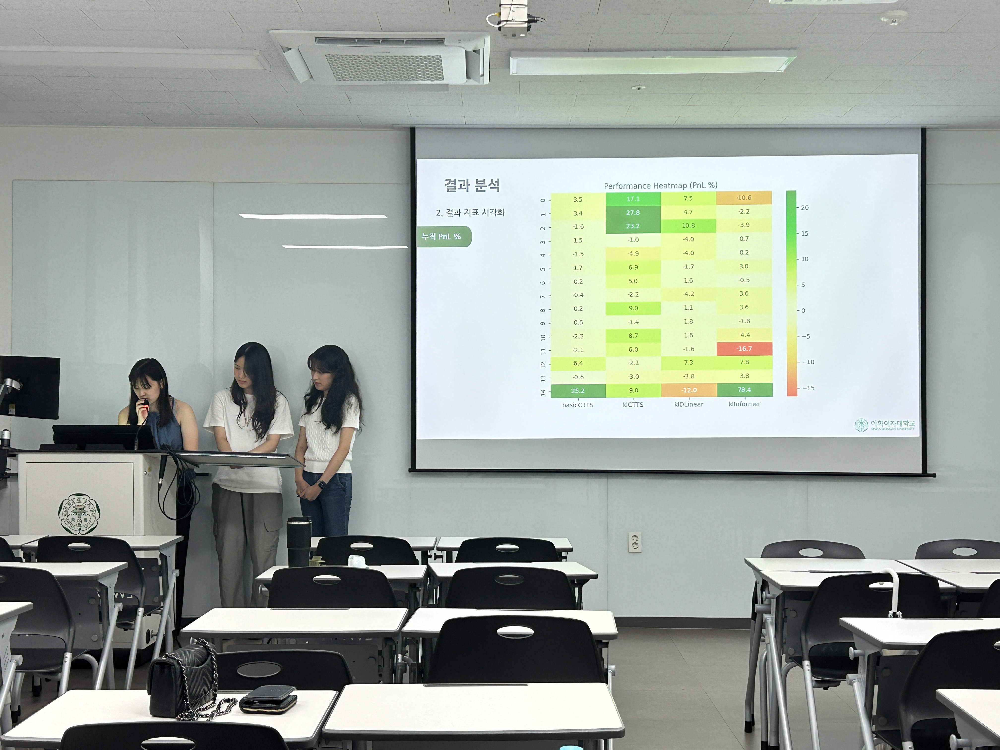

## 선물 시장에서의 최적 스윙 탐색: 강화학습 에이전트 전략 학습  

강화시스터즈 3기 03 세션의 프로젝트로, PPO 알고리즘을 이용해 KOSPI 200 미니 선물 시장에서 수익을 내는 에이전트를 개발했습니다.  

수수료와 슬리피지를 고려한 후, **평균 수익률 6.5%, Sharpe Ratio 0.8, 최대 낙폭 -12%, 승률 48%의** 성능을 보였습니다. 

### 바로가기 ✨
[보고서](../assets/image/Projects/theFutures/theFutures_Report.pdf)  
[PPT](../assets/image/Projects/theFutures/theFutures_PPT.pdf)  
[GitHub](https://github.com/KanghwaSisters/YOLO-Futures.git)

### 사진 📸
  
  
  
  
  
 
 
  
